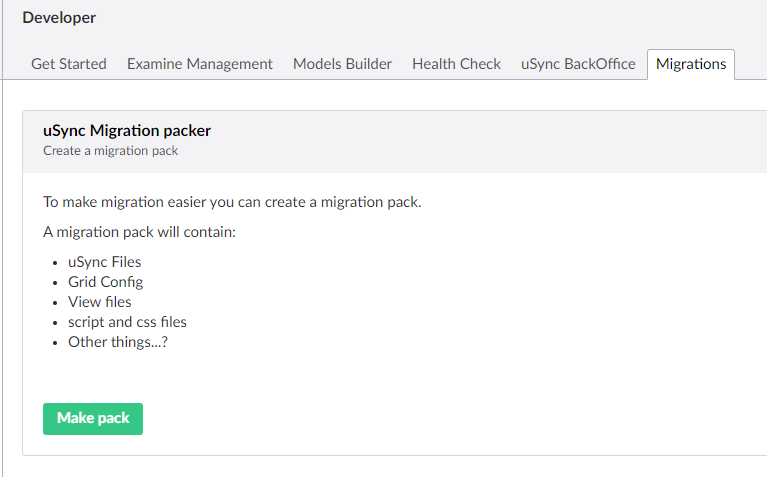

## uSync Migration packers.

Downlevel packages (for umbraco 7,...) that let you get a zip of uSync and other files to make a migration an eaiser thing to do. 

### What ? 

A migration packer package is a simple package for an old version of Umbraco that will present you with the option to create a "migration pack"

A migration pack, is a zip of your sites uSync files, and some extras like the grid config, views, css, etc.

this zip file can then be used as part of a migration with uSync.Migrations

### Why ?

At the moment you can 'just' put the usync folder onto a new site and run the migration, but this 
limits some of the thigns we can do , because ideally we need a bit more info than the uSync files
give us on their own. 

the big one is the grid config. when we have the grid config we can in theory go direct from grid
to block grid, because we have the config.

